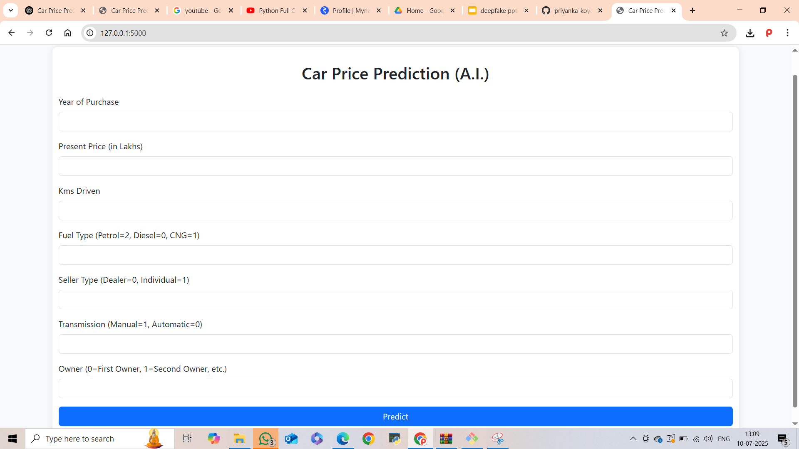

# 🚗 Car Price Prediction (A.I.)

This project predicts the resale price of a car using Machine Learning techniques. It's built using Python, Flask, and a simple HTML+CSS frontend. Users can input car details and get an estimated selling price instantly.

---

## 📷 App UI Screenshot



---

## 🔧 How It Works

Enter the following car details:
- Year of Purchase
- Present Price (in Lakhs)
- Kms Driven
- Fuel Type (Petrol = 2, Diesel = 0, CNG = 1)
- Seller Type (Dealer = 0, Individual = 1)
- Transmission (Manual = 0, Automatic = 1)
- Number of Previous Owners

The model will return the **predicted selling price**.

---

## 🛠️ Tech Stack

- 🧠 **Machine Learning**: Linear Regression
- 🐍 **Backend**: Python, Flask
- 💻 **Frontend**: HTML, CSS
- 📊 **Data**: `car_data.csv`
- 📦 **Dependencies**: See `requirements.txt`

---

## 🚀 How to Run Locally

### 1. Clone the repository
```bash
git clone https://github.com/priyanka-koyalkar29/car-price-prediction-ai.git
cd car-price-prediction-ai
2. Install dependencies
pip install -r requirements.txt
3. Run the app
python app.py
4. Open your browser
Go to: http://127.0.0.1:5000


---

